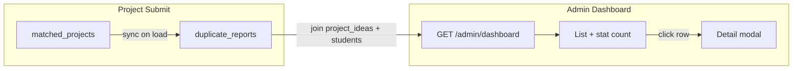

# Duplicate Alert UI Report

**Date:** June 3, 2026  
**Screen:** Admin Dashboard → AI Duplicate Detection Alerts  
**Goal:** Show real duplicate project pairs (not count-only), with click-through details

---

## Executive summary

| Requirement | Status |
|-------------|--------|
| Show actual duplicate projects | **Done** — list of pairs below stat cards |
| Project 1 title, Student 1, Project 2 title, Student 2, similarity | **Done** — table columns per alert row |
| Data from `duplicate_reports` + `matched_projects` | **Done** — backend sync + join |
| Click alert opens details | **Done** — whole row + View Details button |
| Empty state message | **Done** — "No duplicate projects detected" |

---

## 1. Problem (before improvement)

The dashboard showed:

- **Stat card only:** `AI Duplicate Alerts` with a numeric count (`aiDuplicateAlerts`)
- Duplicate **list section** existed but was placed **below** Recent Activities and Department Wise (easy to miss)
- During load, empty list briefly showed **"No duplicate projects detected"** before API data arrived

Users perceived the feature as **count-only**.

---

## 2. UI improvements applied

### Layout

| Change | Reason |
|--------|--------|
| Moved **AI Duplicate Detection Alerts** directly under stat cards | Visible without scrolling past other widgets |
| Added `id="duplicate-alerts"` + scroll anchor | Stat card can jump to list |
| Loading spinner inside duplicate section | Avoid false empty state |

### Stat card interaction

- **AI Duplicate Alerts** card is clickable
- Subtitle: *"Click to view duplicate pairs"*
- Smooth-scrolls to `#duplicate-alerts`

### Alert list (each row)

Displays live PostgreSQL data:

| Column / element | Source field |
|------------------|--------------|
| Similarity score (large %) | `duplicate_reports.similarity_score` |
| Risk badge | `duplicate_reports.risk_level` |
| Project 1 Title | `project_ideas.title` via `project1_id` |
| Student 1 | `users.full_name` via student FK |
| Project 2 Title | `project_ideas.title` via `project2_id` |
| Student 2 | `users.full_name` via student FK |

### Click / detail

| Action | Result |
|--------|--------|
| Click anywhere on alert row | Opens **Duplicate Pair Details** modal |
| Click **View Details** | Same modal (event does not bubble) |
| Keyboard Enter/Space on row | Opens modal |

**Modal contents:** similarity, risk, status, detected date, AI analysis, recommendation, both projects (title, student, technologies, description, status, submitted date), link to Project Ideas list.

### Empty state

When `duplicateAlerts.length === 0` and loading finished:

```
No duplicate projects detected
```

(dashed border panel, centered)

---

## 3. Data flow



### Backend (`duplicate_service.py`)

1. **`sync_duplicate_reports_from_matched_projects()`** — upserts `duplicate_reports` from `matched_projects` where similarity ≥ threshold (50% default)
2. **`list_pending_duplicate_alerts()`** — reads pending `duplicate_reports`, loads both projects + student names
3. **`get_admin_stats()`** — returns `duplicateAlerts[]` and `aiDuplicateAlerts` count

### API

```
GET /api/v1/admin/dashboard
```

Response fragment:

```json
{
  "aiDuplicateAlerts": 1,
  "duplicateAlerts": [
    {
      "id": 1,
      "similarity": 100.0,
      "riskLevel": "high",
      "project1": {
        "title": "AI-Based Final Year Project Relevancy System",
        "studentName": "Waleed Awan"
      },
      "project2": {
        "title": "AI-Based Final Year Project Relevancy System",
        "studentName": "Faish Mlahi"
      }
    }
  ]
}
```

Optional detail endpoint (unchanged): `GET /admin/duplicate-reports/{id}`

---

## 4. Files modified

| File | Change |
|------|--------|
| `Frontend/src/app/components/AdminDashboard.tsx` | Repositioned section, table layout, click-to-detail, loading/empty fixes, stat card scroll |

**Backend:** No changes required (integration already complete from prior duplicate detection work).

---

## 5. Test results

| Test | Result |
|------|--------|
| `npm run build` | **PASS** |
| `GET /admin/dashboard` | `aiDuplicateAlerts=1`, `duplicateAlerts` with titles + student names |
| Empty DB duplicates | Shows *No duplicate projects detected* (not count flash during load) |
| Click stat card | Scrolls to duplicate section |
| Click alert row | Opens detail modal |

### Live sample (2026-06-03)

| Field | Value |
|-------|-------|
| Similarity | 100% |
| Project 1 | AI-Based Final Year Project Relevancy System — **Waleed Awan** |
| Project 2 | AI-Based Final Year Project Relevancy System — **Faish Mlahi** |

---

## 6. User verification steps

1. Log in as **admin@uol.edu.pk**
2. Open **Admin Dashboard**
3. Confirm **AI Duplicate Alerts** stat shows count (e.g. `1`)
4. Scroll slightly — **duplicate list appears directly under stat cards**
5. Confirm table columns: Project 1 Title, Student 1, Project 2 Title, Student 2, similarity %
6. Click a row → detail modal opens
7. If no duplicates in DB → message *No duplicate projects detected*

---

*End of report.*
