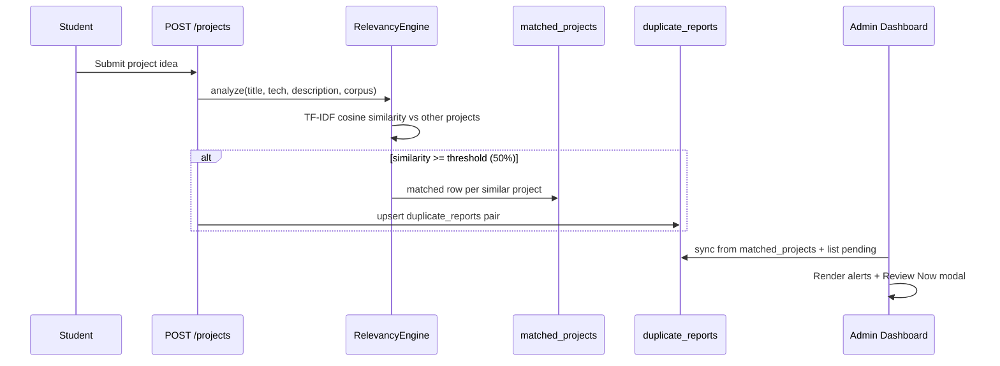

# Duplicate Detection Integration Report

**Date:** June 3, 2026  
**Scope:** End-to-end duplicate detection — relevancy analysis → PostgreSQL → Admin Dashboard UI

---

## Executive summary

Duplicate detection is **fully integrated**. Hardcoded demo records (Emma Wilson, David Brown, etc.) are removed. The Admin Dashboard **AI Duplicate Detection Alerts** section reads **only** from `duplicate_reports`, populated from relevancy `matched_projects` when similarity ≥ **50%** (configurable).

---

## 1. Current duplicate detection flow



### Step-by-step

1. **Submission** — `POST /api/v1/projects` creates `project_ideas` row.
2. **Relevancy** — `project_service.run_relevancy_analysis()` compares the new project to up to 100 other projects via `RelevancyEngine.analyze()`.
3. **Matching** — For each corpus project, `similarity_between()` returns 0–100%. Pairs with similarity ≥ threshold are stored in `matched_projects` (linked to `relevancy_results`).
4. **Duplicate reports** — `duplicate_service.create_reports_from_matches()` upserts rows in `duplicate_reports` with `project1_id`, `project2_id`, `similarity_score`, `risk_level`, `ai_analysis`.
5. **Admin view** — On dashboard load, `sync_duplicate_reports_from_matched_projects()` backfills any historical `matched_projects` not yet in `duplicate_reports`, then returns pending alerts.

---

## 2. Tables used

| Table | Role |
|-------|------|
| `project_ideas` | Source/target projects; titles, descriptions, student FK |
| `relevancy_results` | Per-project AI scores (`similarity_score`, etc.) |
| `matched_projects` | Pair-level similarity from relevancy (`matched_project_id`, `similarity`) |
| `duplicate_reports` | Admin-facing duplicate pairs (`project1_id`, `project2_id`, `similarity_score`, `risk_level`, `status`) |
| `students` / `users` | Student names shown on dashboard cards |

### `duplicate_reports` columns (used)

- `project1_id`, `project2_id` — ordered pair (`min(id)`, `max(id)`)
- `similarity_score` — percentage 0–100
- `risk_level` — `high` (≥75%), `medium` (≥60%), `low` (≥threshold)
- `status` — `pending` shown on dashboard; `reviewed` / `approved` / `dismissed` reserved
- `ai_analysis`, `recommendation` — auto-generated text for Review modal

---

## 3. Threshold configuration

| Setting | Default | Location |
|---------|---------|----------|
| `duplicate_similarity_threshold` | **50.0** (percent) | `backend/app/config/settings.py` (env: `DUPLICATE_SIMILARITY_THRESHOLD`) |

Same threshold drives:

- `RelevancyEngine` — which projects appear in `matched_projects`
- `duplicate_service` — which pairs create/update `duplicate_reports`

**Risk bands** (after threshold met):

| Similarity | Risk level |
|------------|------------|
| ≥ 75% | `high` |
| ≥ 60% | `medium` |
| ≥ 50% (threshold) | `low` |

---

## 4. APIs used

| Method | Path | Purpose |
|--------|------|---------|
| `GET` | `/api/v1/admin/dashboard` | Stats + `duplicateAlerts[]` + activities + departments |
| `GET` | `/api/v1/admin/duplicate-reports` | Standalone list of pending alerts |
| `GET` | `/api/v1/admin/duplicate-reports/{id}` | Single pair detail (Review Now / API consumers) |
| `POST` | `/api/v1/projects` | Triggers relevancy + duplicate report creation (unchanged route) |

### Dashboard response (duplicate slice)

```json
{
  "aiDuplicateAlerts": 1,
  "duplicateAlerts": [
    {
      "id": 1,
      "project1": { "id": 3, "title": "...", "studentName": "Waleed Awan", ... },
      "project2": { "id": 6, "title": "...", "studentName": "Faish Mlahi", ... },
      "similarity": 100.0,
      "riskLevel": "high",
      "status": "pending",
      "detectedDate": "2026-06-03",
      "aiAnalysis": "...",
      "recommendation": "..."
    }
  ]
}
```

---

## 5. Files modified

| File | Change |
|------|--------|
| `backend/app/config/settings.py` | `duplicate_similarity_threshold` setting |
| `backend/app/ai/relevancy_engine.py` | Use settings threshold instead of hardcoded `50` |
| `backend/app/services/duplicate_service.py` | **New** — upsert, sync, list, detail |
| `backend/app/services/project_service.py` | Call `create_reports_from_matches` after relevancy |
| `backend/app/services/admin_service.py` | Include `duplicateAlerts` in dashboard stats |
| `backend/app/schemas/admin.py` | `DuplicateAlertItem`, `DuplicateProjectSummary` |
| `backend/app/routes/admin.py` | `GET /duplicate-reports`, `GET /duplicate-reports/{id}` |
| `Frontend/src/app/services/adminService.ts` | Types + `fetchDuplicateReportDetail` |
| `Frontend/src/app/components/AdminDashboard.tsx` | Real alerts widget, empty state, Review Now modal |

**Not modified:** Auth, review queue writes, notification creation logic, user management CRUD, database schema (tables already existed).

---

## 6. Admin Dashboard UI behavior

| Requirement | Implementation |
|-------------|----------------|
| Keep duplicate feature | Section restored with live data |
| No mock records | Removed all inline `aiAlerts` demo arrays |
| Real PostgreSQL data | `duplicate_reports` + sync from `matched_projects` |
| Empty state | **"No duplicate projects detected"** when `duplicateAlerts.length === 0` |
| Review Now | Opens modal with both projects, AI analysis, recommendation; link to Project Ideas list |

Stat card **AI Duplicate Alerts** count = `duplicateAlerts.length` (pending pairs after sync).

---

## 7. Test results

### Build

| Check | Result |
|-------|--------|
| `npm run build` (Frontend) | **PASS** |

### API (admin token, local DB 2026-06-03)

| Test | Result |
|------|--------|
| `GET /admin/dashboard` | `aiDuplicateAlerts=1`, `duplicateAlerts` length 1 |
| Alert content | Project 3 (Waleed Awan) vs Project 6 (Faish Mlahi), **100%** similarity, **high** risk |
| No demo names | Emma Wilson / David Brown **not** present |
| `GET /admin/duplicate-reports/1` | Returns full pair detail with descriptions |
| Backfill | Existing `matched_projects` rows synced into `duplicate_reports` on dashboard load |

### Regression

| Flow | Status |
|------|--------|
| Project submission + relevancy | Unchanged route; adds duplicate report when threshold met |
| Professor review queue | Not modified |
| Student notifications | Not modified |

---

## 8. Data lineage example (live test)

1. Two students submitted nearly identical **"AI-Based Final Year Project Relevancy System"** proposals.
2. Relevancy stored **100%** similarity in `matched_projects`.
3. Dashboard sync created `duplicate_reports` id **1** (`project1_id=3`, `project2_id=6`).
4. Admin Dashboard displays real student names and **Review Now** opens the detail modal.

---

## 9. Configuration

Add to `backend/.env` (optional):

```env
DUPLICATE_SIMILARITY_THRESHOLD=50.0
```

---

## 10. Optional follow-ups (not implemented)

- Admin action to mark duplicate as `reviewed` / `dismissed`
- Deduplicate notification + duplicate alert in Recent Activities
- Deep-link Project Ideas table to highlighted project IDs from modal

---

*End of integration report.*
