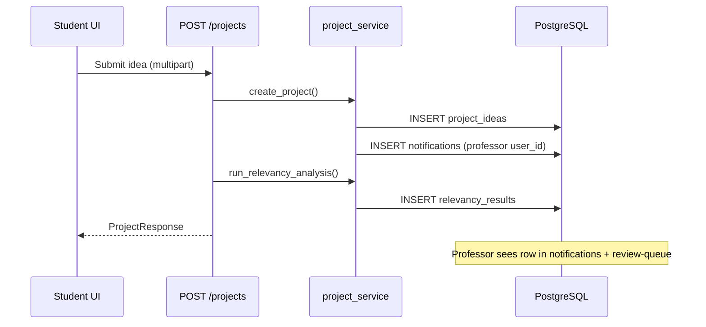

# Professor Notification on Project Submission

**Date:** June 3, 2026  
**Feature:** Notify assigned professor when a student submits a project  
**Student review notifications:** Unchanged (approve/reject/revision flow untouched)

---

## Current behavior (before fix)

### Working

| Step | Behavior |
|------|----------|
| Student submits project | `POST /api/v1/projects` creates `project_ideas` row with `professor_id` |
| Review queue | `GET /api/v1/projects/review-queue` lists pending projects for professor |
| Professor review | `POST /api/v1/projects/{id}/review` updates status |
| Student notified on review | `submit_review()` inserts `notifications` for **student** `user_id` |

### Missing

| Step | Behavior |
|------|----------|
| Professor on submit | **No** `notifications` row created for professor |
| Professor Notifications page | Only showed review-related or older rows |
| Sidebar unread badge | Did not increase on new submission |

---

## Root cause

Professor notifications were only created in `submit_review()` (lines 354–377 in `project_service.py`), which runs when a professor approves, rejects, or requests revision.

`create_project()` persisted the project and set `professor_id`, but never called any notification helper. The submission route (`projects.py` → `create_project` → `run_relevancy_analysis`) therefore left the assigned professor unaware except via the Review Queue list.

`NotificationType.SUBMISSION` already existed in the enum but was unused for this workflow.

---

## Implementation

### New helper

**File:** `backend/app/services/project_service.py`  
**Function:** `_notify_professor_new_submission()`

Called at the end of `create_project()` immediately after `flush()` (project `id` available; same DB transaction as submit).

### Notification record

| Field | Value |
|-------|-------|
| `user_id` | Assigned professor’s `users.id` (`professor.user_id`) |
| `type` | `NotificationType.SUBMISSION` → API value `"submission"` |
| `title` | `New Project Submission` |
| `message` | `Student {student_name} submitted "{project_title}" for review.` |
| `priority` | `high` |
| `color` | `blue` (UI styling; optional) |
| `is_read` | `false` (default) |

`student_name` comes from `student.user.full_name`, with a fallback query if the relationship was not loaded.

### What was not changed

- `submit_review()` student notification block — identical to before  
- Frontend `Notifications.tsx`, `NotificationContext`, routes  
- Database schema / models  
- Review queue logic  

Existing professor notification APIs already support this row:

- `GET /api/v1/notifications` — list for logged-in user  
- Unread count — `NotificationContext` derives from `isRead` on fetched list  

---

## Files modified

| File | Change |
|------|--------|
| `backend/app/services/project_service.py` | Added `_notify_professor_new_submission()`; invoke from `create_project()` |

---

## Database records created

**Table:** `notifications`

Example row (verified via API test):

| Column | Example value |
|--------|----------------|
| `user_id` | Professor user id (e.g. user linked to `professor@uol.edu.pk`) |
| `type` | `submission` |
| `title` | `New Project Submission` |
| `message` | `Student Waleed Awan submitted "E2E Notify Test …" for review.` |
| `priority` | `high` |
| `is_read` | `false` |
| `created_at` | Server timestamp at submit time |

Related rows on submit (unchanged):

- `project_ideas` — new project  
- `relevancy_results` / `matched_projects` — after AI analysis  
- `project_attachments` — optional files  

No new tables or migrations.

---

## Submission workflow (after fix)

---

## Verification steps

### 1. API verification (completed)

With backend running (`uvicorn app.main:app --port 8000`):

1. Login as professor → note unread notification count (optional).  
2. Login as student → `POST /projects` with `professor_email=professor@uol.edu.pk`.  
3. Login as professor → `GET /notifications`.  

**Result (2026-06-03 run):**

- Status: **PASS**  
- Title: `New Project Submission`  
- Message: `Student … submitted "…" for review.`  
- Priority: `high`  
- Type: `submission`  
- `isRead`: `false`  
- Unread count increased by 1  

### 2. Manual UI verification

1. **Professor** — log in as `professor@uol.edu.pk` / `Professor123`.  
2. **Student** — log in as `70140912@student.uol.edu.pk` / `Student123`.  
3. Student → **Submit New Idea** → use supervisor `professor@uol.edu.pk` → submit.  
4. Professor → refresh browser (or re-open app) so `NotificationContext` reloads.  
5. Professor → **Notifications** — confirm **New Project Submission** appears.  
6. Confirm sidebar notification badge shows unread count ≥ 1.  
7. Professor → **Review Queue** — same project still listed (unchanged).  

### 3. Regression — student review notifications

1. Professor approves or rejects a pending project with feedback.  
2. Student → **Notifications** — confirm approval/rejection message still appears.  

No code paths in `submit_review()` were modified.

---

## Frontend notes

| Item | Detail |
|------|--------|
| Notifications page | `type: submission` uses default blue styling and bell icon |
| Filters | Submission appears under **All** and **Unread**; not under Approval-only filter |
| Badge refresh | `NotificationProvider` loads notifications on authentication; full page refresh after submit may be needed if professor session was already open (same pattern as before) |

---

## Summary

| Item | Status |
|------|--------|
| Root cause identified | No professor notification on `create_project` |
| Fix applied | `_notify_professor_new_submission` in `create_project` |
| Stored in `notifications` | Yes |
| Professor Notifications UI | Yes (via existing API) |
| Unread count | Yes (via existing context) |
| Student notifications on review | Unchanged |

---

*End of implementation report.*
