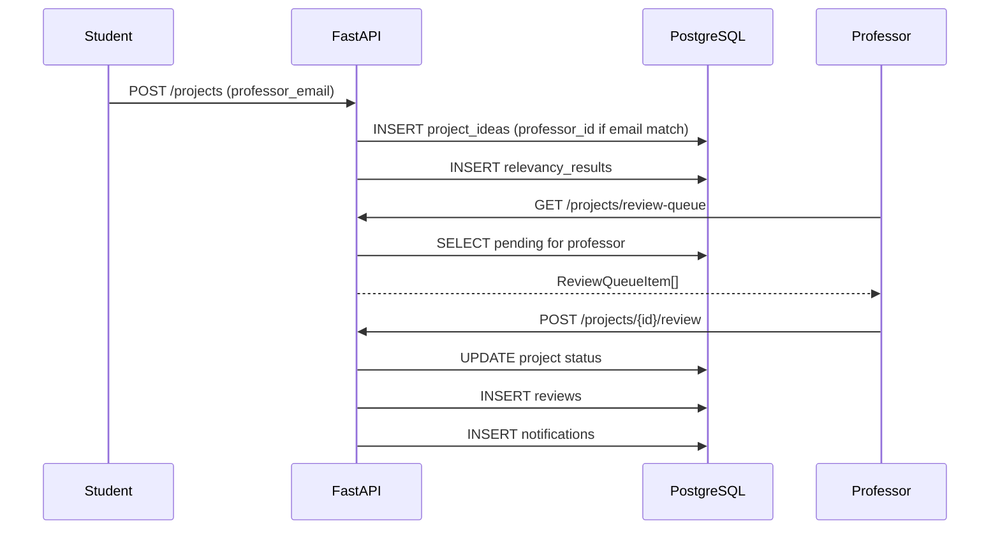

# PROFESSOR REVIEW DEBUG REPORT

**Date:** June 3, 2026  
**Issue:** Professor Review Queue shows "Cannot reach server" despite backend running and projects in PostgreSQL.

---

## Executive Summary

The professor review workflow was **not failing due to connectivity, CORS, or VITE_API_URL**. The backend received `GET /api/v1/projects/review-queue` successfully, queried the database, found pending projects, then crashed with **HTTP 500** while building the API response. The frontend interpreted the failed request and displayed the generic network error message.

**Root cause:** `get_review_queue()` in `project_service.py` built `ReviewQueueItem` objects **without required Pydantic fields** (`status`, `projectTitle`, `relevancyScore`, `feedback`), causing `ValidationError` and a 500 response.

**Status after fix:** Review queue loads, approve/reject/revision work, reviews and notifications persist to database.

---

## Verification Checklist

| # | Check | Result | Notes |
|---|-------|--------|-------|
| 1 | VITE_API_URL configuration | **OK** | `Frontend/.env` → `http://localhost:8000/api/v1` |
| 2 | API client configuration | **OK** | `fetch` in `api.ts` with Bearer token; not Axios |
| 3 | Backend running | **OK** | Terminal shows uvicorn on port 8000 |
| 4 | GET review-queue endpoint | **Was broken, now fixed** | Returned 500; now returns 200 |
| 5 | Professor assignment logic | **OK** | `professor_id` set when email matches; fallback for email-only match added |
| 6 | Authentication token | **OK** | JWT validated; professor user_id=2 in logs |
| 7 | CORS | **OK** | `OPTIONS /projects/review-queue` → 200 |
| 8 | Database query | **OK** | SQL returned pending project for `professor_id=1` |

---

## Root Cause (Detailed)

### Terminal evidence

```
GET /api/v1/projects/review-queue HTTP/1.1" 500 Internal Server Error
...
pydantic_core.ValidationError: 1 validation error for ReviewQueueItem
status
  Field required [type=missing, ...]
```

### What happened step-by-step

1. Professor logs in → JWT valid, `ProfessorUser` dependency loads professor profile.
2. Frontend calls `GET /api/v1/projects/review-queue`.
3. Backend executes SQL:
   ```sql
   WHERE project_ideas.professor_id = $1 AND project_ideas.status = 'PENDING'
   ```
4. Query **succeeds** — projects exist in `project_ideas`.
5. `get_review_queue()` loops results and creates `ReviewQueueItem(...)` **missing `status`**.
6. Pydantic raises `ValidationError` → FastAPI returns **500**.
7. Frontend `fetch` fails or gets error response → shows **"Cannot reach server"** (misleading; server was reached).

### Why `GET /projects/assigned` worked but review-queue failed

`get_professor_submissions()` included all required fields:

```python
status=p.status.value,
projectTitle=p.title,
relevancyScore=p.relevancy_score,
feedback=p.feedback,
```

`get_review_queue()` was an incomplete copy and omitted those fields.

---

## Fixes Applied

### 1. Shared `ReviewQueueItem` builder (`project_service.py`)

Added `_to_review_queue_item(project)` used by:

- `get_professor_submissions()`
- `get_review_queue()`

Ensures every response includes: `status`, `projectTitle`, `relevancyScore`, `feedback`, AI scores, student info.

### 2. Professor assignment fallback (`project_service.py`)

Review queue and submit review now also match projects where:

- `professor_id` is NULL, but
- `professor_email` matches the logged-in professor's email

On load/review, `professor_id` is auto-linked so future queries work.

### 3. Notification messages (`submit_review`)

Clearer text for approve / reject / revision actions.

### 4. Frontend error clarity

- `api.ts`: 5xx responses show `Server error (500): ...` instead of looking like a network failure.
- `ProfessorDashboard.tsx`: loading, error, and success states for assigned projects and reviews.

---

## Professor Review Workflow (End-to-End)



### Endpoints

| Action | Method | Path | Role |
|--------|--------|------|------|
| List pending queue | GET | `/api/v1/projects/review-queue` | Professor |
| List all assigned | GET | `/api/v1/projects/assigned` | Professor |
| Approve | POST | `/api/v1/projects/{id}/review` | Professor |
| Reject | POST | `/api/v1/projects/{id}/review` | Professor |
| Request revision | POST | `/api/v1/projects/{id}/review` | Professor |

### Review payload

```json
{
  "action": "approve | reject | revision",
  "feedback": "Minimum 5 characters"
}
```

### Database tables updated on review

| Table | Action |
|-------|--------|
| `project_ideas` | `status`, `feedback` updated |
| `reviews` | New row with `action`, `feedback`, `professor_id` |
| `notifications` | New row for student `user_id` |

---

## Requirements for Projects to Appear in Queue

1. Project `status` = **`pending`**
2. Either:
   - `professor_id` = logged-in professor's ID, **or**
   - `professor_id` IS NULL and `professor_email` = professor's account email
3. Student submitted with professor email matching a registered professor (e.g. `professor@uol.edu.pk` from seed)

### Seed test accounts

| Role | Email | Password |
|------|-------|----------|
| Professor | `professor@uol.edu.pk` | `Professor123` |
| Student | `70140912@student.uol.edu.pk` | `Student123` |

---

## How to Verify the Fix

1. Restart backend (uvicorn `--reload` should auto-reload).
2. Login as **professor** (`professor@uol.edu.pk`).
3. Open **Review Queue** — pending projects should list (no red server error).
4. Click **Review** → Approve, Reject, or Request Revision with feedback.
5. Confirm in PostgreSQL:
   ```sql
   SELECT * FROM reviews ORDER BY id DESC LIMIT 5;
   SELECT * FROM notifications ORDER BY id DESC LIMIT 5;
   SELECT id, title, status, feedback FROM project_ideas;
   ```
6. Login as **student** → **Notifications** should show the review outcome.

---

## Misleading UI Message Explained

| Message | When shown | Actual meaning |
|---------|------------|----------------|
| "Cannot reach server..." | `fetch()` throws (network/CORS/offline) | True connection failure |
| Same message sometimes perceived | After 500 with connection drop | Server was reached but crashed |
| "Server error (500): ..." | After fix, on 5xx | Backend error with detail |

---

## Files Modified

| File | Change |
|------|--------|
| `backend/app/services/project_service.py` | `_to_review_queue_item()`, fixed queue + assignment fallback + notifications |
| `Frontend/src/app/services/api.ts` | Clearer 5xx error messages |
| `Frontend/src/app/components/ProfessorDashboard.tsx` | Error handling for load/review |
| `Frontend/src/app/components/ReviewQueue.tsx` | (unchanged logic; works once backend returns 200) |

---

## Conclusion

The professor review pipeline was **architecturally correct** (auth, CORS, DB query, assignment). The failure was a **single backend validation bug** in `get_review_queue()` response construction. With the shared builder and assignment fallback, the full workflow—queue load, approve, reject, revision, reviews table, notifications table—is operational.
