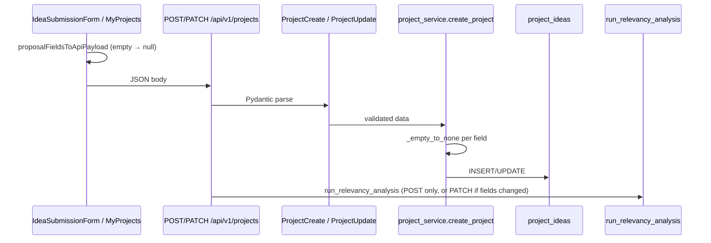

# Proposal Validation Report

**Date:** June 30, 2026  
**Status:** Analysis complete — **no code applied yet** (diffs below are proposed only)  
**Scope:** Enforce meaningful proposal content before submission so the relevancy engine and Ollama explanations receive real text, not empty/null/`"Not Provided"` placeholders.

---

## 1. Executive summary

Students can today submit proposals with only **title**, **description**, **technologies**, and **professor email** filled in. Sections 2–10 are optional in both the React form and the FastAPI `ProjectCreate` schema. Empty values are converted to `null` in the database; the UI displays **`"Not Provided"`** for null/blank fields when viewing proposals.

That leaves the **weighted relevancy engine** and **Ollama prompt** with sparse input. Ollama explicitly substitutes `"Not provided"` for missing fields in `ollama_service._field()`, which degrades explanation quality.

**Recommendation:** Add shared validation rules on **frontend (submit + edit)** and **backend (`ProjectCreate` / `ProjectUpdate`)** without changing API field names, response shapes, database schema, or AI engine code.

---

## 2. Submission flow audit

### 2.1 End-to-end path



### 2.2 React frontend

| Location | Role | Current validation |
|----------|------|-------------------|
| `Frontend/src/app/components/IdeaSubmissionForm.tsx` | New proposal submit | HTML5 `required` on **title**, **description**, **technologies**, **professorEmail** only. No `validateForm()` before POST. Single global `error` string on failure. |
| `Frontend/src/app/components/ProjectProposalSections.tsx` | Shared sections 2–10 | `TextAreaField` supports `required` prop but **never passes `required={true}`**. `proposalFieldsToApiPayload()` strips whitespace → `null`. `displayProposalValue()` shows **"Not Provided"** in read-only views. |
| `Frontend/src/app/components/MyProjects.tsx` | Edit pending/revision projects | Same 4 core HTML `required` fields. No proposal-section validation on save. |
| `Frontend/src/app/utils/validation.ts` | UOL auth rules | **No proposal validation** (registration/login only). |

### 2.3 FastAPI backend

| Location | Role | Current validation |
|----------|------|-------------------|
| `backend/app/schemas/project.py` — `ProjectCreate` | POST body | `title` min 3; `technologies` min 2; `description` min 20; `professor_email` EmailStr. **All 29 extended fields optional** (`str \| None = None`). |
| `backend/app/schemas/project.py` — `ProjectUpdate` | PATCH body | Same min lengths when fields present; extended fields still optional. |
| `backend/app/routes/projects.py` | Endpoints | `POST ""` → `create_project` + `run_relevancy_analysis`. `PATCH /{id}` → `update_project` (relevancy rerun when proposal fields change). **No service-level validation.** |
| `backend/app/services/project_service.py` | Persistence | `_empty_to_none()` converts blank strings to `null`. No content-quality checks. |
| `backend/app/models/project.py` | SQLAlchemy | `title`, `technologies`, `description`, `professor_email` NOT NULL; extended columns nullable. **No change needed.** |
| `backend/app/utils/validators.py` | UOL auth | **No proposal validators.** |
| `backend/app/middleware/exception_handlers.py` | 422 errors | Formats Pydantic errors as `"field: message"` joined by `"; "`. |

### 2.4 AI engine field usage (read-only — not modified)

**Relevancy scoring** (`relevancy_engine.py` weighted text):

| Tier | Weight | Fields |
|------|--------|--------|
| Critical | ×3 | `problem_statement`, `proposed_solution`, `unique_features`, `innovation_aspect` |
| High | ×2 | `current_challenges`, `existing_solutions`, `project_scope`, `competitive_advantage`, `market_gap` |
| Standard | ×1 | `title`, `description`, `technologies`, `target_users`, `target_industry`, `expected_impact`, `existing_solution_limitations` |

**Ollama explanation prompt** (`ollama_service.py`) includes: `title`, `technologies`, `description`, `problem_statement`, `proposed_solution`, `project_scope`, `unique_features`, `innovation_aspect`, `target_users`, `target_industry` — missing values become **`"Not provided"`** in the prompt.

---

## 3. Field name mapping (user terms → codebase)

| User / business label | Frontend form key | API / DB field | Notes |
|----------------------|-------------------|----------------|-------|
| Title | `title` | `title` | Core field |
| Description | `description` | `description` | Core field |
| Problem Statement | `problemStatement` | `problem_statement` | Section 2 |
| Proposed Solution | `proposedSolution` | `proposed_solution` | Section 3 |
| Existing Solution | `existingSolutions` | `existing_solutions` | Section 2 (plural in UI) |
| **Objectives** | `academicImpact` | `academic_impact` | **See §3.1** |
| Scope | `projectScope` | `project_scope` | Section 3 |
| Technologies | `technologies` | `technologies` | Comma-separated tools stack (Section 1 supervisor block) |
| Target Industry | `targetIndustry` | `target_industry` | Section 1 |
| Target Users | `primaryTargetUsers` | `target_users` | Section 5 |
| Expected Impact | `expectedImpact` | `expected_impact` | Section 8 |
| Innovation Aspect | `innovationAspect` | `innovation_aspect` | Section 4 |
| Unique Features | `uniqueFeatures` | `unique_features` | Section 4 |
| Professor (supervisor) | `professorEmail` | `professor_email` | Required for routing; validated at submit via `resolve_professor_for_submission` |

### 3.1 Objectives field note

The legacy DB column **`objectives`** was removed in proposal v3 (`alembic/versions/003_proposal_v2_remove_attachments.py`). There is **no** `objectives` key in current `ProjectCreate` or the submit form.

**Mapping decision for validation:** treat **Objectives** as **`academic_impact`** / **`academicImpact`**, whose form label is *"Academic Impact"* with placeholder *"Contribution to academic knowledge or learning outcomes..."* — the closest v3 field to university **learning objectives**.

User-facing error label: **"Academic Impact (Objectives)"** to avoid confusion with *Expected Impact* (`expected_impact`).

### 3.2 Additional AI-important fields (not in user minimum list)

These are **not** required by your spec but are scored by the engine. Optional to tighten later:

- `current_challenges`, `existing_solution_limitations`, `competitive_advantage`, `market_gap`
- `category` (dropdown; empty string → null today)
- Section 6 checkboxes → `ai_technologies_used` (separate from `technologies` string)

---

## 4. Current gaps

| Gap | Impact |
|-----|--------|
| Sections 2–10 optional on submit | Most projects stored with `null` extended fields |
| Backend `description` min length **20** vs required **100** | API accepts thin descriptions |
| Backend `title` min length **3** vs required **10** | API accepts very short titles |
| No rejection of placeholder text | Students could type `"N/A"`, `"-"`, `"None"` |
| No per-field errors on submit form | Only one red banner at bottom |
| Edit flow (`MyProjects`) same gaps | Revision submissions can remain incomplete |
| `proposalFieldsToApiPayload` sends `null` for empty | Correct for API, but validation must run **before** conversion |
| 422 errors flattened to one string | `parseApiErrorDetail` works but submit UI does not map errors to fields yet |

---

## 5. Proposed validation rules

### 5.1 Shared placeholder rejection

Reject (case-insensitive, after trim) if value equals any of:

- `not provided`
- `n/a`
- `na`
- `-`
- `none`
- `null`
- `tbd`
- `todo`

Also reject if, after trim, the string is **empty** or **only whitespace**.

### 5.2 Minimum content rules

Measured on **trimmed** string length unless noted.

| Field | API key | Min length / rule | Example error message |
|-------|---------|-------------------|------------------------|
| Title | `title` | ≥ 10 | Title must contain at least 10 characters. |
| Description | `description` | ≥ 100 | Description must contain at least 100 meaningful characters. |
| Problem Statement | `problem_statement` | ≥ 80 | Problem Statement must contain at least 80 meaningful characters. |
| Proposed Solution | `proposed_solution` | ≥ 80 | Proposed Solution must contain at least 80 meaningful characters. |
| Objectives | `academic_impact` | ≥ 50 | Academic Impact (Objectives) must contain at least 50 meaningful characters. |
| Existing Solution | `existing_solutions` | ≥ 50 | Existing Solutions must contain at least 50 meaningful characters. |
| Scope | `project_scope` | ≥ 50 | Project Scope must contain at least 50 meaningful characters. |
| Technologies | `technologies` | ≥ 1 token after split on `,` / `;` | Technologies must list at least one technology (e.g. Python, React). |
| Target Industry | `target_industry` | ≥ 3 (non-placeholder) | Target Industry is required. |
| Target Users | `target_users` | ≥ 20 | Primary Target Users must contain at least 20 meaningful characters. |
| Expected Impact | `expected_impact` | ≥ 40 | Expected Impact must contain at least 40 meaningful characters. |
| Innovation Aspect | `innovation_aspect` | ≥ 40 | Innovation Aspect must contain at least 40 meaningful characters. |
| Unique Features | `unique_features` | ≥ 40 | Unique Features must contain at least 40 meaningful characters. |
| Professor Email | `professor_email` | existing EmailStr + professor must exist | unchanged (already enforced in service) |

**`ProjectCreate`:** all rows above are **required** on create.

**`ProjectUpdate`:** apply the same rules **only when the field is present** in the PATCH body (partial update safe).

### 5.3 Technologies parsing rule

```text
tokens = re.split(r"[,;|/]+", value)
tokens = [t.strip() for t in tokens if t.strip() and not is_placeholder(t)]
valid if len(tokens) >= 1
```

---

## 6. Proposed files (no changes applied yet)

| File | Action |
|------|--------|
| `backend/app/utils/proposal_validators.py` | **Create** — shared `validate_proposal_text`, `validate_technologies_list`, `PROPOSAL_FIELD_RULES` |
| `backend/app/schemas/project.py` | **Extend** — Pydantic `field_validator` / `model_validator` on `ProjectCreate` and `ProjectUpdate` |
| `backend/tests/test_proposal_validation.py` | **Create** — unit tests for placeholders, min lengths, PATCH partial |
| `Frontend/src/app/utils/proposalValidation.ts` | **Create** — mirror backend rules + camelCase keys |
| `Frontend/src/app/components/IdeaSubmissionForm.tsx` | **Extend** — `fieldErrors` state, `validateProposalForm()`, inline errors |
| `Frontend/src/app/components/MyProjects.tsx` | **Extend** — same validation on edit save |
| `Frontend/src/app/components/ProjectProposalSections.tsx` | **Extend** — `error` on `TextAreaField`, mark required labels `*` |

**Explicitly NOT changed:** `relevancy_engine.py`, `ollama_service.py`, `embeddings.py`, SQLAlchemy models, migrations, API route paths, response model field names.

---

## 7. Proposed code diffs (preview)

### 7.1 NEW `backend/app/utils/proposal_validators.py`

```python
"""Proposal content validation for AI relevancy analysis."""

from __future__ import annotations

import re
from typing import Any

PLACEHOLDER_VALUES = frozenset({
    "not provided", "n/a", "na", "-", "none", "null", "tbd", "todo",
})

# api_field_name -> (min_length, human_label)
REQUIRED_TEXT_FIELDS: dict[str, tuple[int, str]] = {
    "title": (10, "Title"),
    "description": (100, "Description"),
    "problem_statement": (80, "Problem Statement"),
    "proposed_solution": (80, "Proposed Solution"),
    "academic_impact": (50, "Academic Impact (Objectives)"),
    "existing_solutions": (50, "Existing Solutions"),
    "project_scope": (50, "Project Scope"),
    "target_industry": (3, "Target Industry"),
    "target_users": (20, "Primary Target Users"),
    "expected_impact": (40, "Expected Impact"),
    "innovation_aspect": (40, "Innovation Aspect"),
    "unique_features": (40, "Unique Features"),
}


def is_placeholder(value: str) -> bool:
    return value.strip().lower() in PLACEHOLDER_VALUES


def validate_proposal_text(
    value: str | None,
    *,
    min_length: int,
    label: str,
    required: bool = True,
) -> str:
    if value is None or not str(value).strip():
        if required:
            raise ValueError(f"{label} is required.")
        return ""
    text = str(value).strip()
    if is_placeholder(text):
        raise ValueError(f'{label} cannot be "{text}". Provide a real description.')
    if len(text) < min_length:
        raise ValueError(
            f"{label} must contain at least {min_length} meaningful characters."
        )
    return text


def validate_technologies(value: str | None) -> str:
    if value is None or not str(value).strip():
        raise ValueError("Technologies must list at least one technology (e.g. Python, React).")
    text = str(value).strip()
    if is_placeholder(text):
        raise ValueError("Technologies cannot be a placeholder. List real tools or frameworks.")
    tokens = [t.strip() for t in re.split(r"[,;|/]+", text) if t.strip()]
    tokens = [t for t in tokens if not is_placeholder(t)]
    if not tokens:
        raise ValueError("Technologies must list at least one technology (e.g. Python, React).")
    return text


def validate_project_create_payload(data: dict[str, Any]) -> None:
    """Raise ValueError with first failing field message."""
    validate_technologies(data.get("technologies"))
    for field, (min_len, label) in REQUIRED_TEXT_FIELDS.items():
        validate_proposal_text(data.get(field), min_length=min_len, label=label)
```

### 7.2 `backend/app/schemas/project.py` (excerpt)

```diff
+from pydantic import field_validator, model_validator
+from app.utils.proposal_validators import (
+    REQUIRED_TEXT_FIELDS,
+    validate_proposal_text,
+    validate_technologies,
+)

 class ProjectCreate(BaseModel):
-    title: str = Field(..., min_length=3, max_length=500)
-    technologies: str = Field(..., min_length=2, max_length=500)
-    description: str = Field(..., min_length=20)
+    title: str = Field(..., min_length=10, max_length=500)
+    technologies: str = Field(..., min_length=2, max_length=500)
+    description: str = Field(..., min_length=100)
     professor_email: EmailStr
-    ...
+    # Extended fields — required for meaningful AI analysis
+    target_industry: str = Field(..., min_length=3)
+    problem_statement: str = Field(..., min_length=80)
+    existing_solutions: str = Field(..., min_length=50)
+    proposed_solution: str = Field(..., min_length=80)
+    project_scope: str = Field(..., min_length=50)
+    unique_features: str = Field(..., min_length=40)
+    innovation_aspect: str = Field(..., min_length=40)
+    target_users: str = Field(..., min_length=20)
+    expected_impact: str = Field(..., min_length=40)
+    academic_impact: str = Field(..., min_length=50)
+
+    @field_validator("technologies")
+    @classmethod
+    def check_technologies(cls, v: str) -> str:
+        return validate_technologies(v)
+
+    @model_validator(mode="after")
+    def check_required_text_fields(self) -> "ProjectCreate":
+        for field, (min_len, label) in REQUIRED_TEXT_FIELDS.items():
+            if field == "technologies":
+                continue
+            value = getattr(self, field, None)
+            validate_proposal_text(value, min_length=min_len, label=label)
+        return self
```

**Note on API contract:** Field names and types stay the same (`str` / `EmailStr`). Only **constraints** tighten. Optional fields remain optional on **`ProjectUpdate`** via validators that skip `None`.

```diff
 class ProjectUpdate(BaseModel):
     ...
+
+    @field_validator("technologies")
+    @classmethod
+    def check_technologies(cls, v: str | None) -> str | None:
+        if v is None:
+            return None
+        return validate_technologies(v)
+
+    @model_validator(mode="after")
+    def check_text_fields_when_present(self) -> "ProjectUpdate":
+        for field, (min_len, label) in REQUIRED_TEXT_FIELDS.items():
+            if field == "technologies":
+                continue
+            value = getattr(self, field, None)
+            if value is not None:
+                validate_proposal_text(value, min_length=min_len, label=label)
+        for core in ("title", "description"):
+            value = getattr(self, core, None)
+            if value is not None:
+                min_len, label = REQUIRED_TEXT_FIELDS[core]
+                validate_proposal_text(value, min_length=min_len, label=label)
+        return self
```

### 7.3 NEW `Frontend/src/app/utils/proposalValidation.ts`

```typescript
const PLACEHOLDERS = new Set(['not provided', 'n/a', 'na', '-', 'none', 'null', 'tbd', 'todo']);

export type ProposalValidationErrors = Record<string, string>;

const RULES: { key: string; min: number; label: string }[] = [
  { key: 'title', min: 10, label: 'Title' },
  { key: 'description', min: 100, label: 'Description' },
  { key: 'problemStatement', min: 80, label: 'Problem Statement' },
  { key: 'proposedSolution', min: 80, label: 'Proposed Solution' },
  { key: 'academicImpact', min: 50, label: 'Academic Impact (Objectives)' },
  { key: 'existingSolutions', min: 50, label: 'Existing Solutions' },
  { key: 'projectScope', min: 50, label: 'Project Scope' },
  { key: 'targetIndustry', min: 3, label: 'Target Industry' },
  { key: 'primaryTargetUsers', min: 20, label: 'Primary Target Users' },
  { key: 'expectedImpact', min: 40, label: 'Expected Impact' },
  { key: 'innovationAspect', min: 40, label: 'Innovation Aspect' },
  { key: 'uniqueFeatures', min: 40, label: 'Unique Features' },
];

function isPlaceholder(s: string): boolean {
  return PLACEHOLDERS.has(s.trim().toLowerCase());
}

function checkText(value: string | undefined, min: number, label: string): string | null {
  const t = (value ?? '').trim();
  if (!t) return `${label} is required.`;
  if (isPlaceholder(t)) return `${label} cannot be "${t}". Provide a real description.`;
  if (t.length < min) return `${label} must contain at least ${min} meaningful characters.`;
  return null;
}

export function validateTechnologies(value: string | undefined): string | null {
  const t = (value ?? '').trim();
  if (!t || isPlaceholder(t)) {
    return 'Technologies must list at least one technology (e.g. Python, React).';
  }
  const tokens = t.split(/[,;|/]+/).map((x) => x.trim()).filter(Boolean).filter((x) => !isPlaceholder(x));
  if (!tokens.length) {
    return 'Technologies must list at least one technology (e.g. Python, React).';
  }
  return null;
}

export function validateProposalForm(values: {
  title: string;
  description: string;
  technologies: string;
  professorEmail?: string;
} & Record<string, string>): ProposalValidationErrors {
  const errors: ProposalValidationErrors = {};
  for (const { key, min, label } of RULES) {
    const msg = checkText(values[key], min, label);
    if (msg) errors[key] = msg;
  }
  const techErr = validateTechnologies(values.technologies);
  if (techErr) errors.technologies = techErr;
  if (!values.professorEmail?.trim()) {
    errors.professorEmail = 'Professor email is required.';
  }
  return errors;
}
```

### 7.4 `Frontend/src/app/components/IdeaSubmissionForm.tsx` (excerpt)

```diff
+import { validateProposalForm } from '../utils/proposalValidation';

 export default function IdeaSubmissionForm(...) {
   ...
+  const [fieldErrors, setFieldErrors] = useState<Record<string, string>>({});

   const handleSubmit = async (e: React.FormEvent) => {
     e.preventDefault();
     setError('');
+    const errors = validateProposalForm({
+      ...formData,
+      aiTechnologiesUsed: serializeAiTechnologies(selectedAiTech),
+    });
+    setFieldErrors(errors);
+    if (Object.keys(errors).length > 0) return;
     setSubmitting(true);
```

```diff
         <input
           name="title"
           ...
           required
         />
+        {fieldErrors.title && (
+          <p className="text-sm text-red-600 mt-1">{fieldErrors.title}</p>
+        )}
```

(Same pattern for each field; pass `error={fieldErrors.problemStatement}` into `TextAreaField`.)

### 7.5 `Frontend/src/app/components/ProjectProposalSections.tsx` (excerpt)

```diff
 function TextAreaField({
   ...
+  error,
 }: {
   ...
+  error?: string;
 }) {
   return (
     <div>
       ...
       <textarea ... />
+      {error && <p className="text-sm text-red-600 dark:text-red-400 mt-1">{error}</p>}
     </div>
   );
 }
```

```diff
-        <TextAreaField name="problemStatement" label="Problem Statement" ... />
+        <TextAreaField name="problemStatement" label="Problem Statement" required ... />
```

Add `*` to required labels: Problem Statement, Proposed Solution, Existing Solutions, Project Scope, Unique Features, Innovation Aspect, Primary Target Users, Expected Impact, **Academic Impact** (objectives).

### 7.6 `Frontend/src/app/components/MyProjects.tsx` (excerpt)

```diff
+import { validateProposalForm } from '../utils/proposalValidation';

   const handleSaveEdit = async (e: React.FormEvent) => {
     e.preventDefault();
     if (!editProject) return;
+    const errors = validateProposalForm({
+      ...editForm,
+      aiTechnologiesUsed: serializeAiTechnologies(editAiTech),
+    });
+    if (Object.keys(errors).length > 0) {
+      setEditError(Object.values(errors)[0]);
+      return;
+    }
```

*(Follow-up improvement: per-field errors in edit modal like submit form.)*

### 7.7 NEW `backend/tests/test_proposal_validation.py` (outline)

```python
import pytest
from pydantic import ValidationError
from app.schemas.project import ProjectCreate, ProjectUpdate

VALID_BASE = { ... }  # factory with all fields above minimums

def test_rejects_placeholder_problem_statement():
    data = {**VALID_BASE, "problem_statement": "N/A"}
    with pytest.raises(ValidationError):
        ProjectCreate(**data)

def test_patch_allows_omitted_fields():
    ProjectUpdate(title="Updated Title Long Enough")
```

---

## 8. Error UX plan

| Layer | Behavior |
|-------|----------|
| Frontend submit | Red text **under each invalid field**; block POST until clean |
| Frontend edit | Show first error in banner (phase 1); per-field (phase 2) |
| Backend POST/PATCH | HTTP **422** with `detail`: `"problem_statement: Problem Statement must contain at least 80 meaningful characters."` |
| API client | Existing `parseApiErrorDetail` already surfaces 422 string; optional: parse `field: msg` pairs into `fieldErrors` on catch |

---

## 9. Test plan (after implementation)

1. **Unit:** `test_proposal_validation.py` — placeholders, min lengths, valid payload passes.
2. **API:** POST `/projects` with only title/description/technologies → expect 422 listing missing fields.
3. **API:** POST with `"N/A"` problem statement → 422 placeholder message.
4. **UI:** Submit empty Section 2 → errors beside fields, no network call.
5. **UI:** Complete valid proposal → 200, relevancy runs as today.
6. **Regression:** Existing seeded projects unchanged in DB; only **new** submits / **edits** validated.
7. **PATCH:** Update single field with too-short value → 422; omit field → unchanged.

---

## 10. Risks and mitigations

| Risk | Mitigation |
|------|------------|
| Stricter rules block quick demo submits | Seed data already in DB; only new submissions affected |
| `academic_impact` labeled "Academic Impact" not "Objectives" | Use combined label in errors; optional UI rename |
| Students confuse `technologies` vs Section 6 AI checkboxes | Keep rule on `technologies` string only (per spec); AI checkboxes remain optional |
| 422 single-string detail hard to map to fields | Frontend validates first; backend is safety net |
| University import scripts with thin text | Scripts bypass API; unaffected |

---

## 11. Approval checklist

- [ ] Confirm **Objectives → `academic_impact`** mapping is acceptable  
- [ ] Confirm **Scope → `project_scope` min 50** (you specified objectives 50 but not scope length; 50 proposed for AI quality)  
- [ ] Confirm **Target Industry min 3** and **Target Users min 20**  
- [ ] Review proposed diffs in §7  
- [ ] Approve implementation PR (backend + frontend + tests)

---

## 12. Next step

**Awaiting your approval** to apply the diffs in §7. No production code has been modified as part of this report.

After approval, implementation order:

1. `proposal_validators.py` + tests  
2. `ProjectCreate` / `ProjectUpdate` validators  
3. `proposalValidation.ts`  
4. `IdeaSubmissionForm` + `ProjectProposalSections` + `MyProjects`  
5. Manual + automated test pass  
